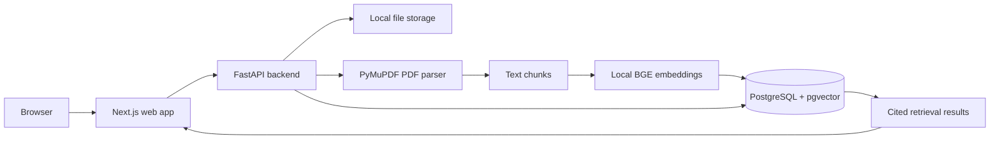

# System Overview

DocIntel AI is local-first. The frontend calls FastAPI, FastAPI stores uploaded files locally, PyMuPDF extracts PDF text, sentence-transformers creates BGE embeddings, and PostgreSQL with pgvector stores searchable 384-dimensional vectors.

No paid AI APIs are required for the MVP.

